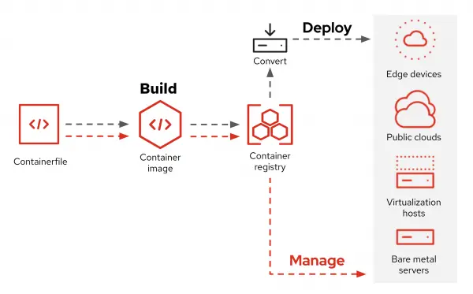
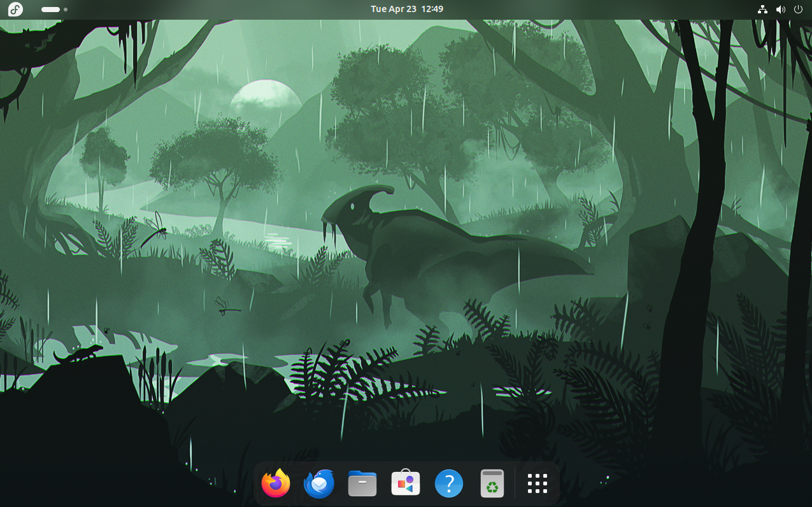

## Bootable containers with <br/> bootc-image-builder

Gianluca Zuccarelli

*Software Engineer - image builder*

[#osbuild](https://redhat.enterprise.slack.com/archives/C0235DZB0DT)

---

### About Me

- studied at WIT/SETU
- interned in the Waterford Office
- joined the image-builder team in 2021

---

### Topics

- what is a bootable container?
- what is image mode?
- what problems is it trying to solve?
- challenges
- demo
- questions

---

### Image lifecycle



Note: DevConf German Maglione's talk has a slide on this at 1:50 https://www.youtube.com/watch?v=ERVyBc_fElY

---

### What is a bootable container?

It is an OCI container with a kernel, bootloader, bootc and other tools for managing the OS,
such as network manager, podman, filesystem tools and bootc itself.

---

### Traits of a bootable container

- immutable*
- layered
- atomic updates
    - updates are automatic
    - can be rolled back

---

### What is image mode?

In a nutshell, image mode is a container-native approach to building, deploying and managing operating systems.
We can manage the entire OS via the container ecosystem. Image mode uses bootc bootable containers to do this.

---

### What is it trying to solve?

- scalability
- security

Note: DevConf keynote "What if you could boot a container?" https://www.youtube.com/watch?v=ERVyBc_fElY

---

### Image lifecycle


**Build > Deploy > Manage**

---

### Not just for edge



---

### bootc-image-builder

bootc-image-builder is a tool that we can used to build disk images from the bootable container.

---

### Deriving containers

```
FROM quay.io/fedora/fedora-bootc:latest

...
<application logic here>
...

```

---

### Users

```
RUN useradd -G wheel exampleuser && \
    mkdir -m 0700 -p /home/exampleuser/.ssh && \
    echo $sshpubkey > /home/exampleuser/.ssh/authorized_keys && \
    chmod 0600 /home/exampleuser/.ssh/authorized_keys && \
    chown -R exampleuser: /home/exampleuser
```

---

### Users

```
{
  "blueprint": {
    "customizations": {
      "user": [
        {
          "name": "kingsley",
          "password": "password42",
          "key": "ssh-ed25519 AAAAC3NzaC1lZDI1NTE5AAAAIBCWAwAqV3weCALKWrSAAHir+oIga1TU5VL4hnjWWU2x",
          "groups": [
            "wheel"
          ]
        }
      ]
    }
  }
}
```

---

### Challenges

- containers-storage
- manifest lists

---

### Demo

---

### Some notes

- podman-bootc terminal app
- podman desktop bootc extension

---

### Links

- [github.com/osbuild/osbuild](github.com/osbuild/osbuild)
- [github.com/osbuild/images](github.com/osbuild/images)
- [github.com/osbuild/bootc-image-builder](github.com/osbuild/bootc-image-builder)

---


### Questions

---

### Thank You!

---
